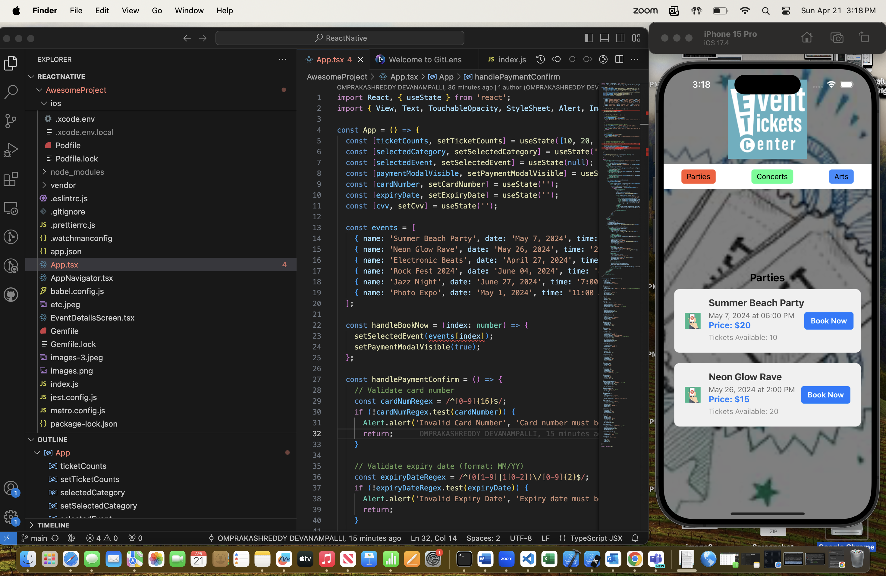
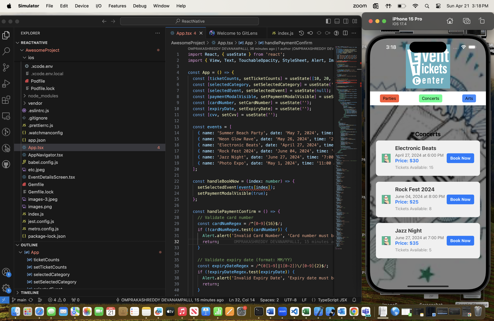
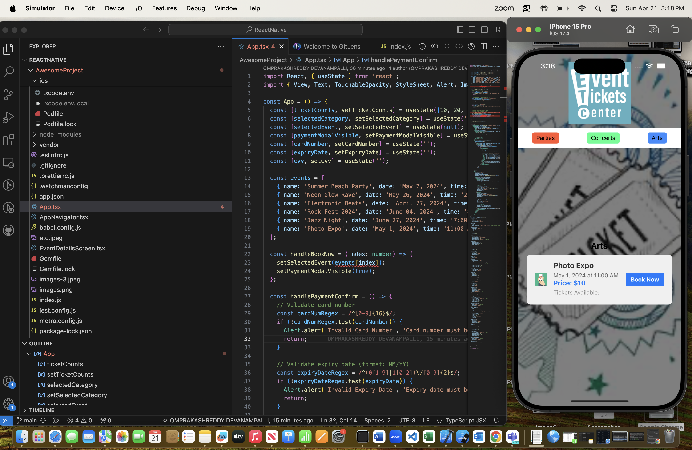
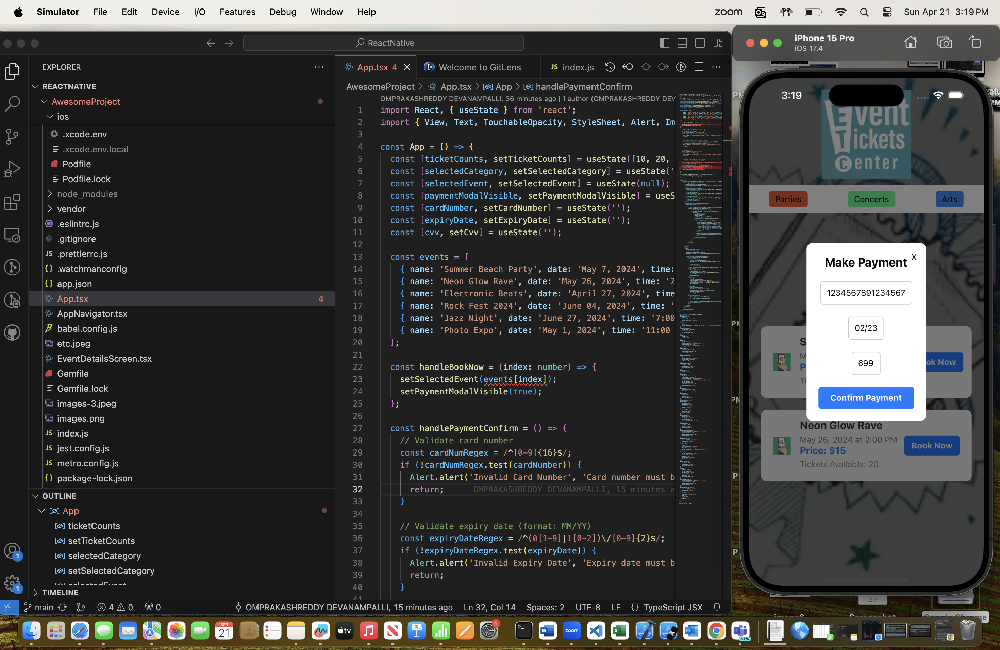
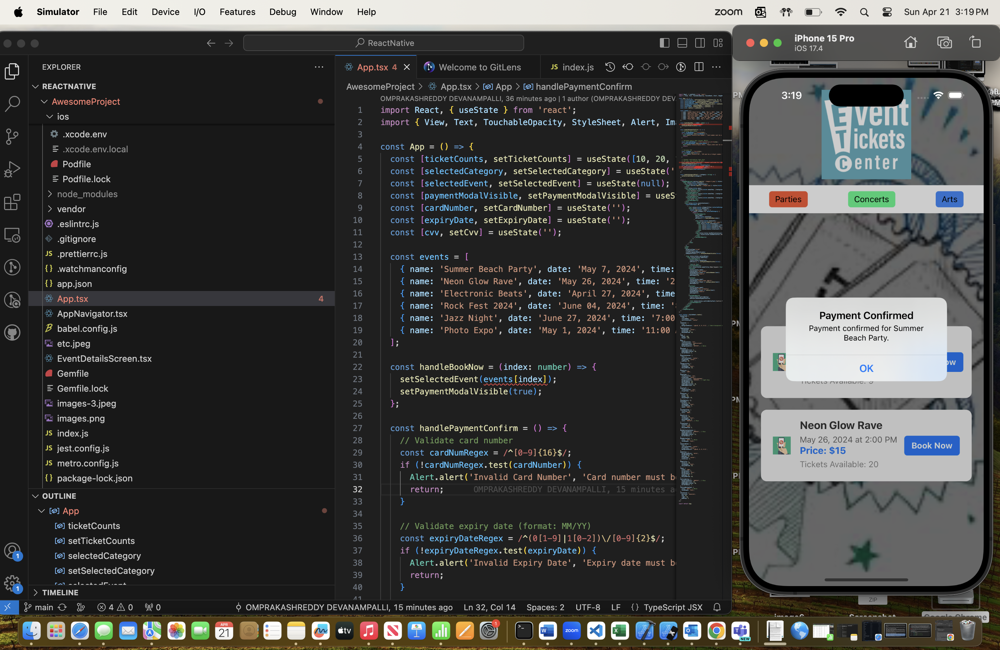
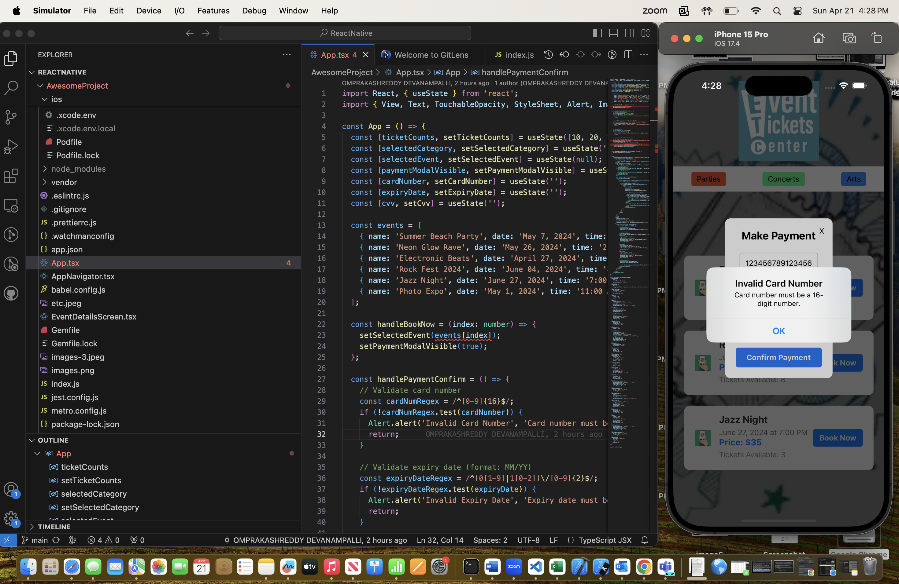
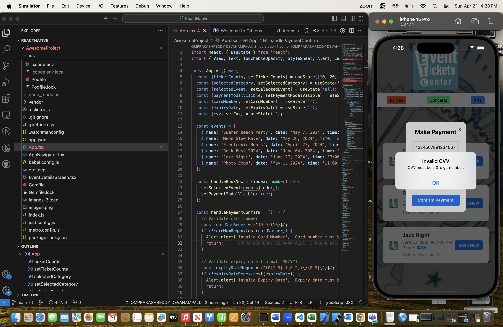
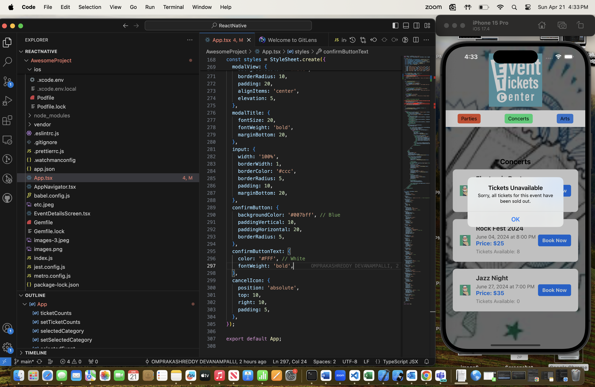

                  Personal Mobile App Project Final

                  Project Title : Event Ticketing

                  Team Members:
                   OMPRAKASHREDDY DEVANAMPALLI
                   RESHMA REDDY VALLAKONDA

About the app:

Users can browse and purchase tickets for a variety of events, including concerts, parties, and art exhibits, with this React Native app. The application features a menu with classified event options that is easy to use. The software allows users to choose an event category and then dynamically presents all of the events that fall into that category along with their names, dates, hours, costs, and the quantity of tickets that are still available. Users can reserve tickets for an event by choosing it, which opens a payment mode where they can enter their card information to finalize the transaction. To ensure accurate payment processing, the app also includes card number, expiration date, and CVV validation. Users receive a notice verifying their booking as soon as payment is approved, and the number of tickets available for the chosen event is subsequently reduced. All things considered, this app offers consumers a practical and effective way to find, investigate, and reserve tickets for a range of events.

About the code:

This React Native code snippet creates an event booking application by utilizing a number of important coding concepts and approaches. 
First, component-level state is managed by using React's `useState` hook in conjunction with functional components. As a result, efficient re-renders and dynamic changes depending on user interactions are possible. The application creates an interactive and aesthetically pleasing user interface by using React Native's built-in components, including {View}, {Text{, {TouchableOpacity}, `StyleSheet{, {ImageBackground}, {Modal}, {TextInput{, and `Image}. The `StyleSheet.create` technique is utilized to style these components, guaranteeing codebase uniformity and comprehensibility. {onPress} handlers support event handling, allowing users to choose event categories, reserve tickets, and validate payments. Regular expressions (`Regex`) are used in input validation to make sure that user-supplied data, like card numbers, expiration dates, and CVV numbers, follow predefined standards. Using arrays to manage ticket counts ({ticketCounts}) for several event types is essential. Accurate tracking of ticket availability is ensured by the dynamic updating of this array, which contains the number of available tickets for each event when users book them. Furthermore, the program makes use of {Modal` components to show payment confirmation dialogs, giving users an easy-to-use interface through which to complete their transactions.
All things considered, this code shows how to combine React Native's features and best practices to produce an event booking app that is both useful and easy to use.

Note : We have used App.tsx, AppNavigator.tsx file to run the code and you can view the files in the same repository.

App Demonstration :

Party events : The user interface of this React Native app allows users to browse and purchase tickets for a variety of events, including concerts, parties, and art exhibitions. A list of party events with their specifics, including name, date, hour, cost, and number of tickets still available, appears when you pick the "Parties" category. Once the user has selected an event, they can purchase tickets by entering their card details in a payment modal that appears for confirmation. Once verified, the payment is handled, and the number of tickets available for the chosen event is subsequently reduced.

Concert events : Users may find and reserve tickets for a variety of events, such as concerts, parties, and the arts, via the React Native app's interactive platform. The software dynamically generates a list of concert events with the event name, date, time, price, and available tickets when users select the "Concerts" category. Users can reserve tickets after choosing an event that interests them. Entering card information will initiate a payment process to complete the transaction. The purchase is completed and the quantity of tickets available for the chosen concert event drops as soon as the confirmation is successful.

Art events : The React Native app offers a convenient way to browse and purchase tickets for a variety of events, including concerts, parties, and the arts. The app presents a detailed list of art events with important information such as event name, date, time, price, and remaining ticket availability when the user selects the "Arts" category. Customers may easily purchase tickets for the art event of their choice, which will prompt a payment modal to collect credit card information for verification. The user receives a confirmation notification after the payment procedure is successful, and the number of tickets that are still available for the selected art event is updated accordingly.

Payment Page : This React Native application's payment page is a crucial step in the ticket purchasing process, enabling safe transactions for reservations for events. After choosing an event and starting the booking process, consumers are sent to a modal where they enter their credit card information to complete the transaction. Users are prompted to enter their card number, CVV (Card Verification Value), and expiration date (in MM/YY format) on the modal. The page includes validation tests for every input field to guarantee data accuracy and provide prompt feedback in the event that an error occurs. The system executes the transaction and shows a confirmation alert to users, verifying the successful reservation, as soon as they successfully validate their payment information. This simplified payment procedure guarantees the smooth completion of event reservations and improves customer experience.

Card Details : This React Native application's details entering page is a crucial part that allows users to enter the information needed to purchase tickets. When customers order tickets for a particular event, they are redirected to this page where they can submit their payment information in a modal window. Within specific input fields, users are invited to enter their card number, expiration date (in MM/YY format), and CVV (Card Verification Value). Every input field has validation tools to guarantee data completeness and accuracy, allowing users to quickly fix any mistakes before submitting. Users complete the purchase and start the payment process after entering their information and confirming. A smooth user experience is enhanced by this page's validation features and user-friendly design, enhancing the efficiency and reliability of the ticket booking journey.

Payment Confirmed : This React Native application's payment confirmation page serves as the last stop before users book tickets, giving them peace of mind and verification that their transaction was completed. Users are redirected to this page after successfully entering their payment details and confirming the reservation. It usually includes information on the event for which tickets have been reserved, along with a confirmation message informing users that their payment has been handled successfully. Users can feel reassured by this page that their reservation has been completed safely. It might also offer choices for customers to check the specifics of their reservation or get a digital receipt for confirmation. All things considered, the payment confirmation page is a crucial step in the user journey that guarantees a smooth and satisfying experience for users finishing event bookings.

Invalid card number : The system quickly alerts customers to errors when they try to enter an invalid card number on the payment page of this React Native application. Users receive a notice stating that the submitted information is invalid when they enter a card number that does not follow the mandated 16-digit format. This notification asks users to check that their input follows the required format for card numbers. The program enhances the user experience by eliminating potential difficulties and enabling users to repair errors quickly and proceed with the payment process easily by providing prompt feedback on invalid inputs.

Invalid expiry date : The system immediately notifies customers of errors if they provide an invalid expiration date on the payment page of this React Native application. Expiration dates must be submitted in the format MM/YY; any other format will result in an alert stating that the data entered is invalid. Users are guided to amend their input by this instantaneous feedback, which guarantees adherence to the specified format. The application enables a seamless payment process by instantly identifying and notifying inaccuracies in expiry date input. This allows users to repair mistakes efficiently and continue with their transaction with minimal disturbance. By simplifying the payment process and lowering potential frustration, this proactive strategy increases consumer happiness.

Invalid CVV : The system quickly alerts users to errors when they enter an invalid CVV (Card Verification Value) on the payment page of this React Native application. Any variation from the required three-digit format for the CVV results in an alert stating that the entered CVV is invalid. Users are immediately prompted to correct their input in order to ensure that it follows the prescribed format. The application enables a smooth payment process by quickly detecting and notifying faults in the CVV input. This allows users to quickly correct errors and complete their transaction without any needless delays. This proactive strategy reduces possible frustration and streamlines the payment process to increase consumer happiness.

Tickets Unavailable : When consumers try to purchase tickets for an event that is sold out in the React Native application, the "Tickets Unavailable" page shows up. It informs consumers that there are no more tickets available for the event they have selected, which stops them from making the purchase. This prompt acts as a crucial warning to users, guaranteeing openness regarding the state of ticket availability and averting pointless attempts to reserve sold-out events. The application helps manage user expectations and prevents potential frustrations by communicating ticket availability in a simple and honest manner. Furthermore, in an effort to improve user engagement and general application satisfaction, this page might also offer recommendations for users to check out other events that are happening or sign up for alerts about upcoming ticket releases.

Event App Video Demonstration:

[Event App Video Demonstration link](https://drive.google.com/file/d/1MY_eQAXQbAGZtKj_NYOHS9meN5Gff3de/view?usp=share_link)

